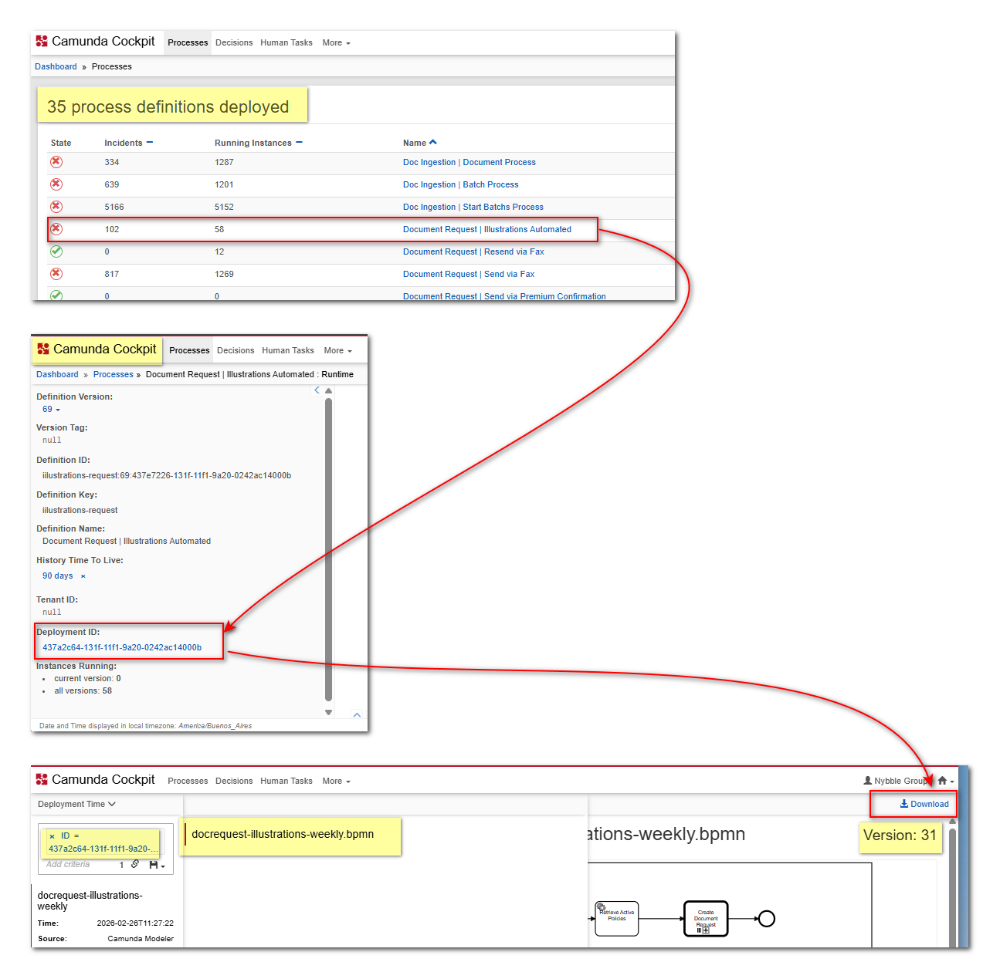
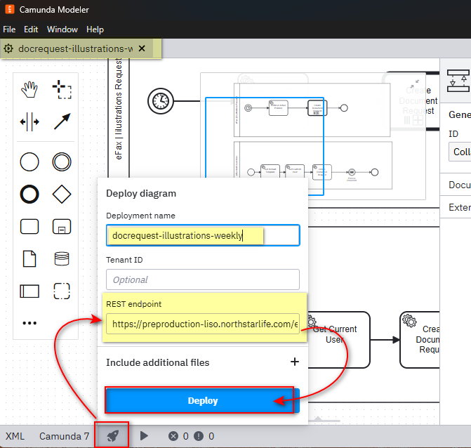
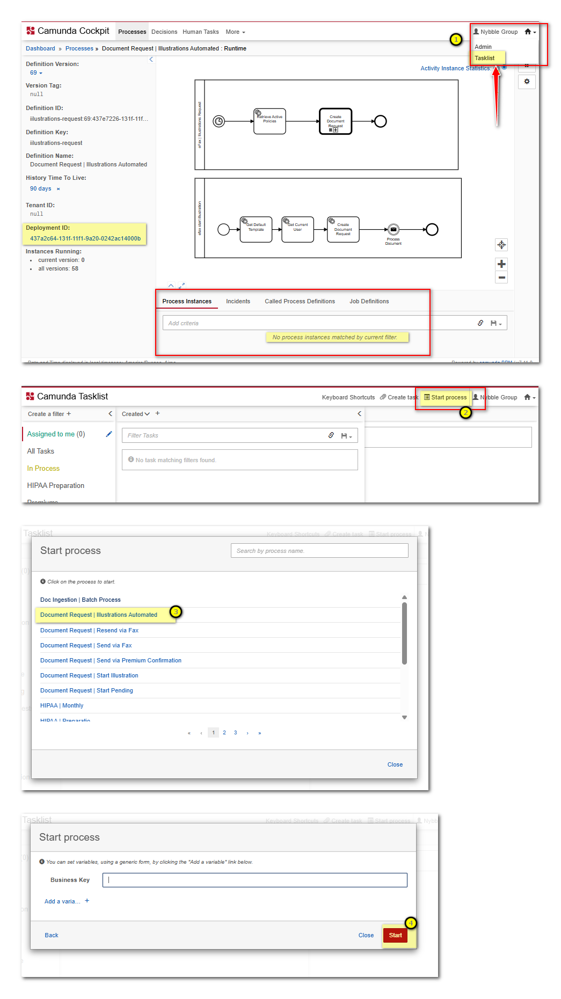

# Como deployar BPMN a PP sin pasar por el proceso normal de GitHub
> Esto aplica solo a cambios unicamente a bpmn, si hay otros cambios, no se aplicaran o deployaran a PP

### 🚨 Importante!. Hacer backup de los .bpmn de PP que se van a actualizar
- Ir a la web de camunda de PP, localizar el proceso
- Menu de la izquierda, hacer click sobre el hash de "Deployment ID"
- En la parte superior, derecha tenemos el link de "Download", hacer click y guardar el archivo .bpmn por si se necesita restaurar luego.

### Pasos para deployar a PP sin pasar por GitHub

- Con los cambios en nuestro branch en el archivo .bpmn, abrir Camunda Modeler.
- Validar nuestros cambios
- En la parte inferior, tenemos un icono de cohete que es el "Deploy".
- Como en este caso queremos deployar directamente a PP, la url a colocar en "REST endpoint" es: https://preproduction-liso.northstarlife.com/engine-rest
- Dar click al boton "Deploy" y esperar a que se complete el proceso, dandonos un mensaje de exito o error.

### Ejecutar el proceso en PP y revisar cambios
- Ir a la web de camunda de PP, localizar el proceso
- Hacer click en el proceso. A primera instancia aqui ya deberiamos ver que NO tiene ningun Process Instance y que su version a cambiado.
- Menu superior a la derecha, tenemos un icono de una casa, hacer click y seleccion la opcion "Tasklist"
- Aqui dentro en la parte superior seleccionar la opcion "Start process" y luego seleccionar el proceso que acabamos de deployar, completar los campos necesarios y dar click en "Start"
